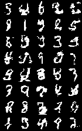

# reptile-gen

This is an experiment in using SGD + a simple feedforward network as an autoregressive generative model.

# The Idea

MAML and Reptile effectively turn feedforward networks (e.g. CNNs and MLPs) into sequence models. Just like in an RNN, MAML and Reptile have a state (the network parameters) which is updated over time (every inner-loop training step). Thus, we can pose a sequence of `N` tuples `(x_i, y_i)` as a dataset of inputs (`x_i`) and outputs (`y_i`), and use MAML/Reptile to train the network to predict the output `y_i` given input `x_i` after being tuned (with SGD) on all of the previous input/output pairs in the dataset. In text generation, I set `x_i` to the index of the current character. For image generation, I set `x_i` to the 2-D pixel coordinate.

Generation using such a model is simple:

 * Set `i` = 0.
 * Set `theta` = parameters learned with Reptile/MAML.
 * Set `x_i` = some fixed indices/coordinates.
 * For `i` from 1 to `N`:
   * Compute `P = f_theta(x_i)`, i.e. the network output for input `i`.
   * Compute `y_i` by sampling from `P` (which is typically logits).
   * Take an SGD step to increase `P(y_i)`.
 * The result of all `y_i` is the sampled sequence.

A more concrete example can be found in [text_sample.py](text_sample.py), and is simplified here for illustration:

```python
model = load_text_model()
opt = optim.SGD(model.parameters())
sequence = []
for i in range(128):
    # Create input Tensor containing x_i (the index).
    inputs = torch.from_numpy(np.array([[i]])).to(device).long()
    # Compute output distribution, P.
    logits = model(inputs)
    probs = F.softmax(logits[0], dim=0).detach().cpu().numpy()
    # Sample from the output distribution.
    sample = np.random.choice(np.arange(256), p=probs)
    sequence.append(int(sample))
    # NUL character ends the sequence early.
    if sample == 0:
        break
    # Generate a target vector to increase P(sample).
    targets = torch.from_numpy(np.array([sample])).to(device).long()
    # Compute -P(sample) and take a step to minimize it.
    loss = F.cross_entropy(logits, targets)
    opt.zero_grad()
    loss.backward()
    opt.step()

# Print the final sample.
print(str(bytes([min(0x79, x) for x in sequence]), 'ascii'))
```

# Experiments

I tried reptile-gen with both MAML and Reptile on two tasks: text generation and binarized sequential MNIST generation.

I also experimented with different model architectures. First I tried vanilla MLPs, but quickly saw some improvement by switching to gated activation functions. Presumably, this allowed the model to prevent certain parameters from being heavily affected by every SGD step. I found the most improvement from using an LSTM block directly, but with no recurrent connections. Essentially, it was just an LSTM block where the state vector was just another trainable parameter.

# Results

Here are the best MNIST samples my models were able to generate. Not very nice looking!



All of my experiments resulted in significant underfitting. However, MAML tended to produce better models than Reptile, indicating that Reptile's gradient-free nature prevents it from modeling long-term dependencies.

The best architecture for reptile-gen was, by a small margin, the LSTM block with no recurrent connections. Since LSTMs were not taylored for reptile-gen, it seems likely that a gating mechanism more taylored for reptile-gen could produce better results. However, my interested in the project started to run thin before I got to that.
